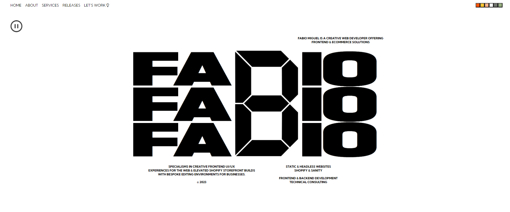
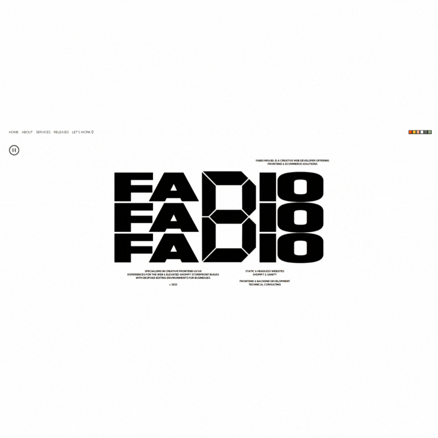
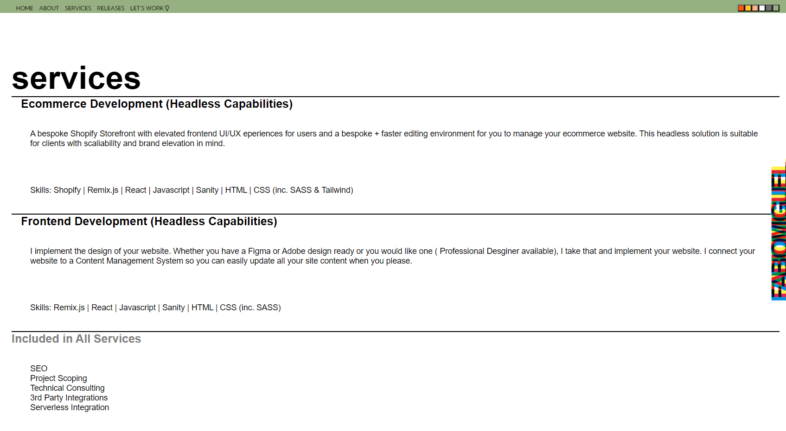

# fabiomiguel.com - v2

The Second iteration of fabiomiguel.com built with React and hosted with Netlify

Previous Iterations: [v1](https://github.com/fabio-miguel/V1)

## Tech Stack

**Client:** React, Sass

## Screenshots





## Installation

To install the required dependencies, simply run the following command in the project's root directory:

```bash
  npm install
```

## Usage

To start the development server, run the following command:

```bash
  npm start
```

The application will be available at http://localhost:3000
